# 🐾 Anabulcom – Web untuk Pusat Layanan Hewan


Anabulcom adalah sistem informasi dan reservasi berbasis web yang dirancang untuk mendukung pusat layanan hewan berbasis UMKM dalam mengelola layanan seperti grooming, hotel kucing, dan konsultasi dokter hewan secara digital.

Sistem ini membantu meningkatkan efisiensi operasional sekaligus memudahkan pelanggan dalam mengakses layanan dan mengelola reservasi secara online.

---

## 📸 Tampilan Aplikasi

### Halaman Utama (Homepage)
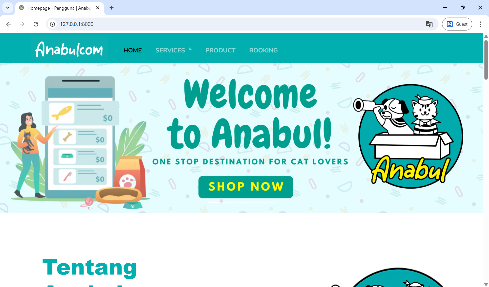
Halaman utama Anabulcom dengan tagline *"One Stop Destination for Cat Lovers"* dan tombol **Shop Now**.

### Halaman Layanan – Cat Grooming Center
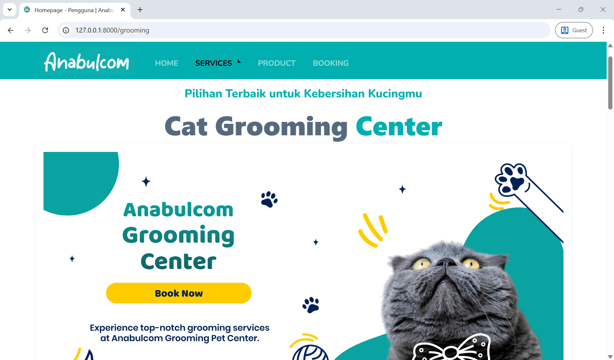
Halaman layanan grooming lengkap dengan banner dan tombol *Book Now*.

### Halaman Layanan – Premium Cat Hotel
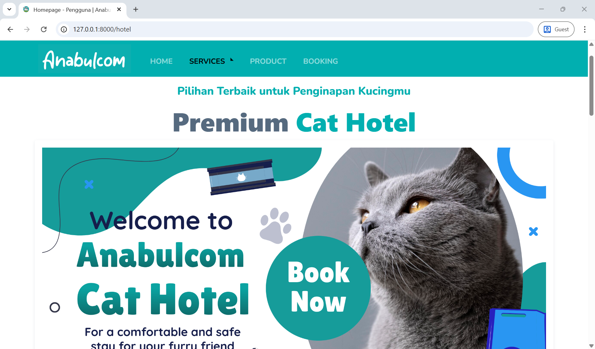
Halaman layanan cat hotel dengan informasi penginapan premium untuk kucing.

### Halaman Layanan – Dokter Hewan / Vets
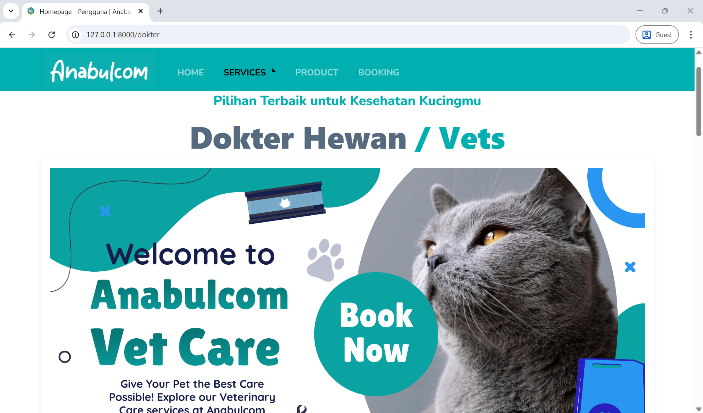
Halaman layanan dokter hewan dengan fitur pemesanan konsultasi.

### Halaman Produk (User)
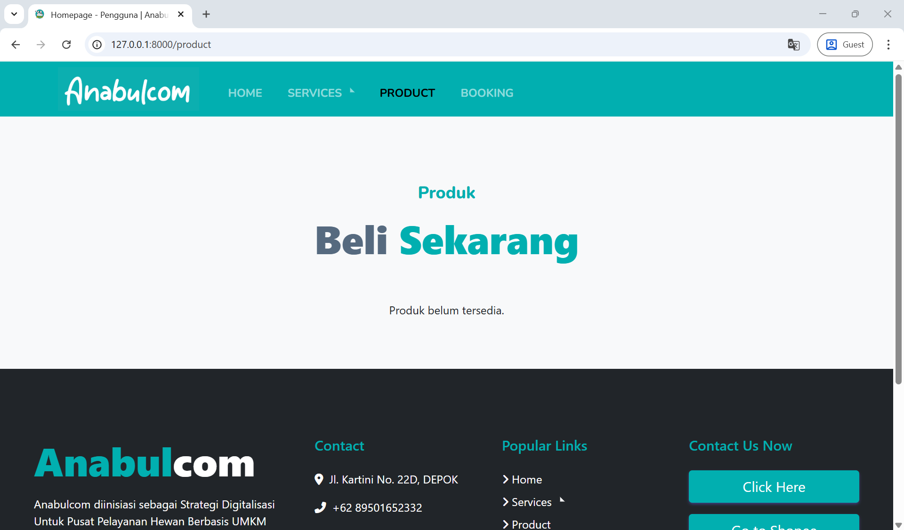
Halaman produk untuk pengguna. Menampilkan pesan *"Produk belum tersedia"* jika belum ada produk.

### Halaman Booking
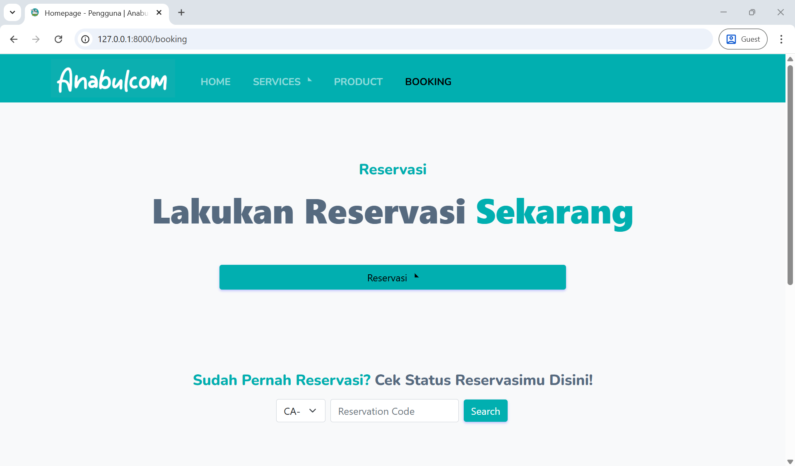
Halaman reservasi dengan pilihan layanan dan fitur cek status reservasi menggunakan kode reservasi.

### Form Reservasi Grooming
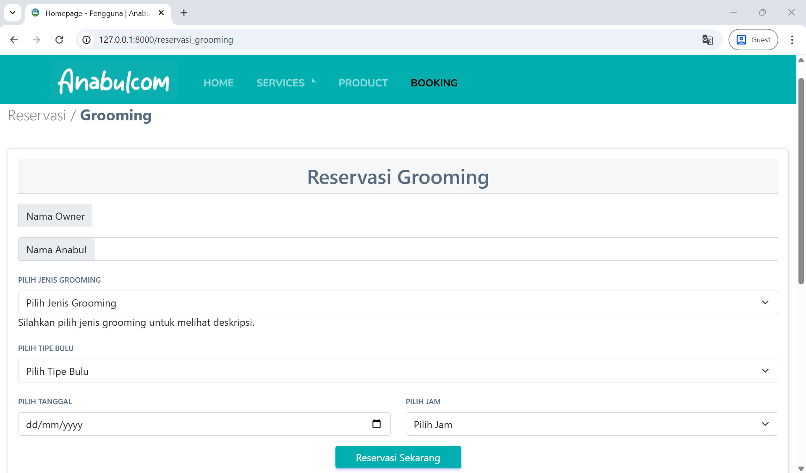
Form reservasi grooming dengan input nama owner, nama anabul, jenis grooming, tipe bulu, tanggal, dan jam.

### Cek Status Reservasi
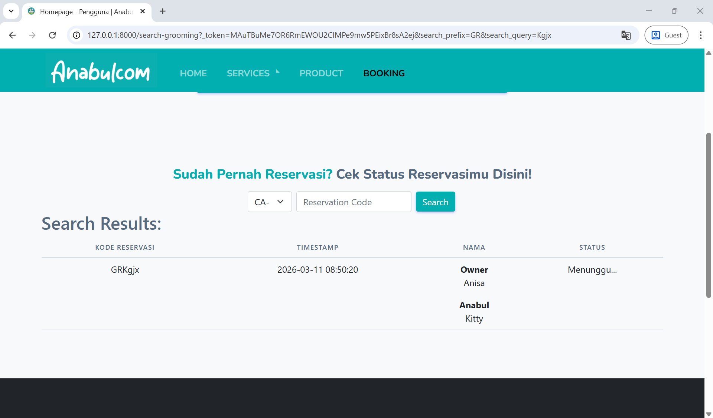
Fitur pencarian status reservasi berdasarkan kode unik yang diberikan saat pemesanan.

---

### Dashboard Admin – List Produk
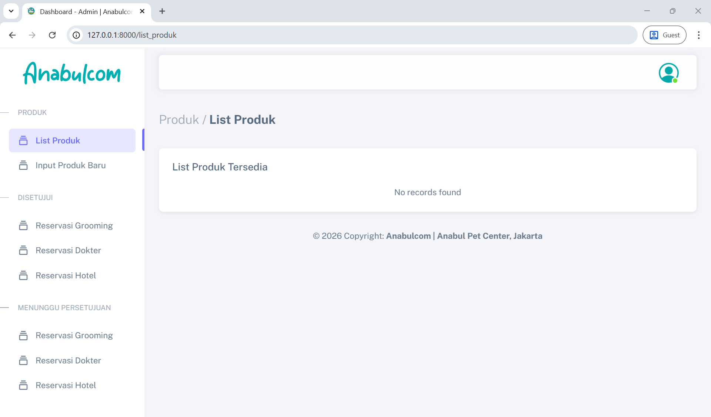
Halaman daftar produk pada panel admin.

### Dashboard Admin – Input Produk Baru
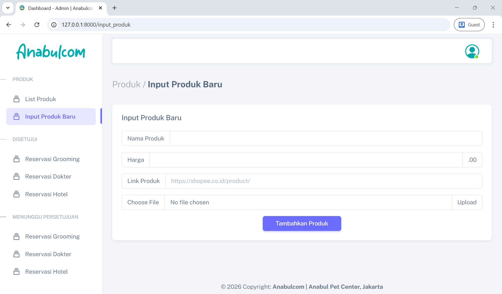
Form penambahan produk baru dengan field nama produk, harga, link produk (Shopee), dan upload gambar.

### Dashboard Admin – Menunggu / Reservasi Grooming
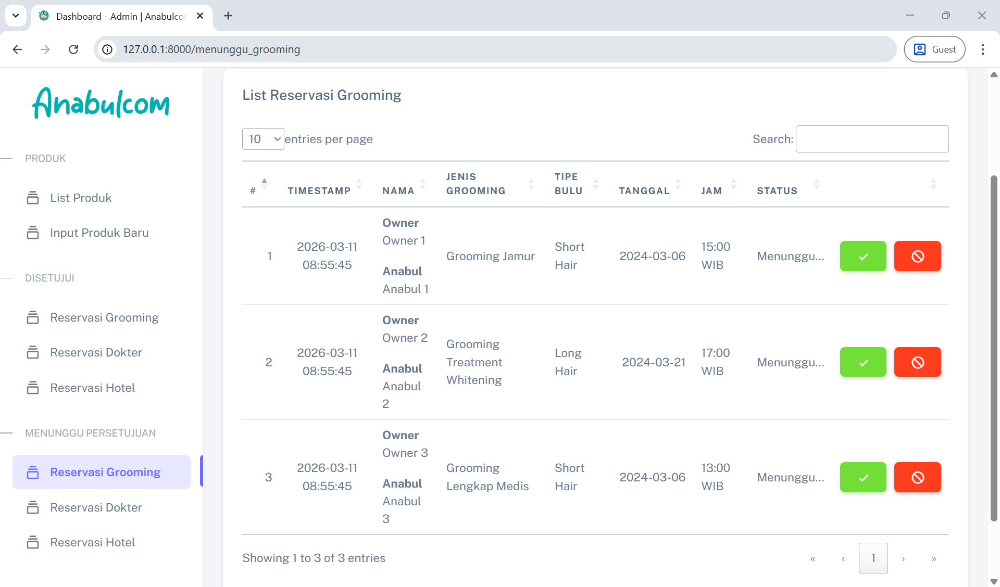
Daftar reservasi grooming yang menunggu persetujuan admin, lengkap dengan tombol approve (✔) dan tolak (🚫).

### Dashboard Admin – Menunggu / Reservasi Dokter
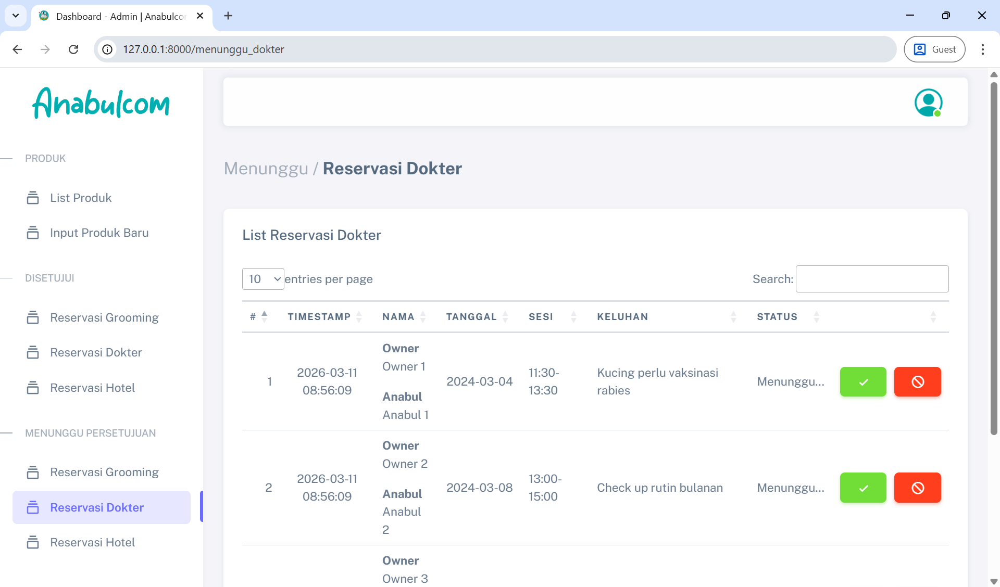
Daftar reservasi dokter hewan yang menunggu persetujuan, dengan informasi tanggal, sesi, dan keluhan.

### Dashboard Admin – Menunggu / Reservasi Hotel
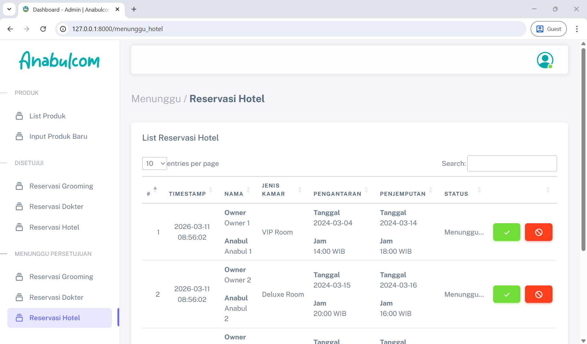
Daftar reservasi hotel kucing yang menunggu persetujuan, beserta informasi pengantaran dan penjemputan.

### Dashboard Admin – Disetujui / Reservasi Grooming
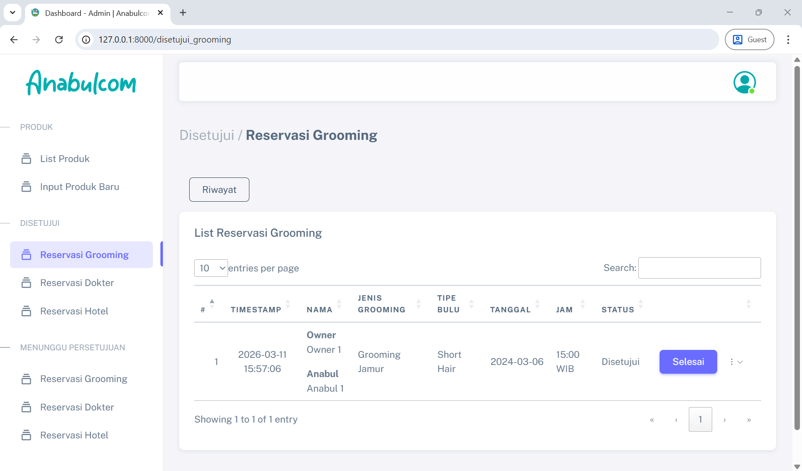
Daftar reservasi grooming yang telah disetujui, dengan tombol **Selesai** untuk menandai selesai.

### Dashboard Admin – Disetujui / Reservasi Dokter
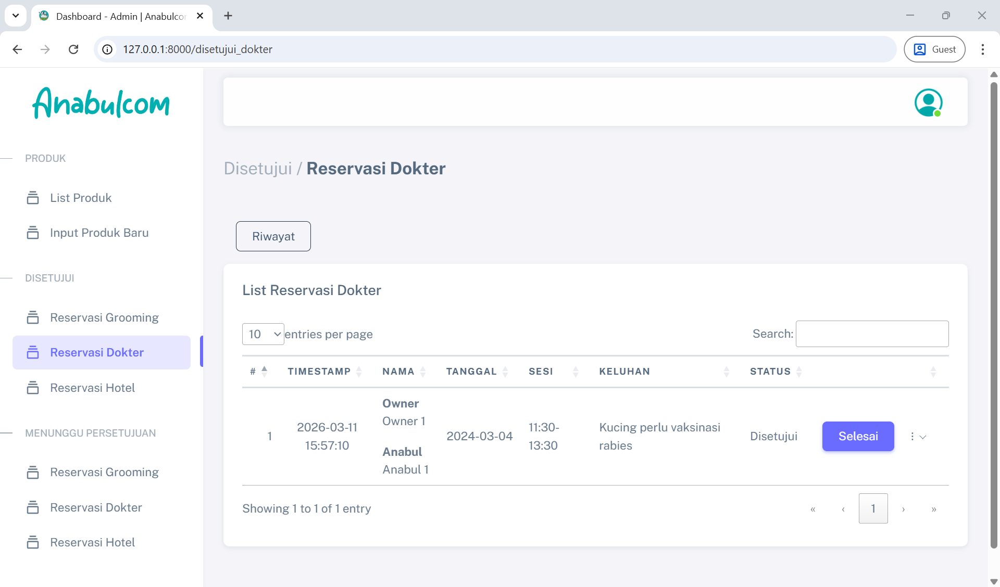
Daftar reservasi dokter hewan yang telah disetujui.

### Dashboard Admin – Disetujui / Reservasi Hotel
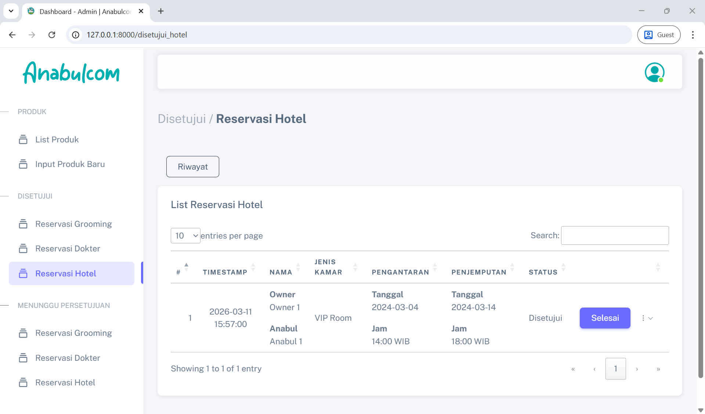
Daftar reservasi hotel kucing yang telah disetujui beserta detail kamar, pengantaran, dan penjemputan.

---

## 📌 Fitur

### 👩‍💼 Fitur Admin
- Mengelola data produk (tambah, lihat, input baru)
- Mengelola reservasi grooming, hotel kucing, dan dokter hewan
- Menyetujui atau menolak reservasi yang masuk
- Menandai reservasi yang telah selesai
- Melihat riwayat reservasi

### 👤 Fitur Pengguna
- Melihat informasi tentang Anabulcom dan layanan yang tersedia
- Melakukan reservasi online (grooming, hotel kucing, dokter)
- Menerima kode reservasi unik setelah pemesanan
- Mengecek status reservasi menggunakan kode reservasi
- Melihat produk yang tersedia (terintegrasi dengan Shopee)

---

## 🛠️ Tech Stack

- PHP (Laravel Framework)
- HTML
- CSS
- JavaScript
- MySQL Database

---

## ⚙️ Instalasi

### 1. Clone Repository
```bash
git clone https://github.com/your-username/anabulcom.git
cd anabulcom
```

### 2. Install Dependencies
```bash
composer install
npm install
```

### 3. Konfigurasi Environment
Salin `.env.example` ke `.env` dan atur konfigurasi database:
```bash
cp .env.example .env
php artisan key:generate
```

Edit konfigurasi database di `.env`:
```env
DB_DATABASE=nama_database
DB_USERNAME=username_database
DB_PASSWORD=password_database
```

---

## 🗃️ Migrasi Database
```bash
php artisan migrate
```

---

## ▶️ Jalankan Aplikasi
```bash
php artisan serve
```

Buka di browser:
```
http://127.0.0.1:8000/
```

---

## 📁 Struktur Halaman

| URL | Halaman |
|-----|---------|
| `/` | Homepage |
| `/grooming` | Layanan Grooming |
| `/hotel` | Layanan Cat Hotel |
| `/dokter` | Layanan Dokter Hewan |
| `/product` | Halaman Produk |
| `/booking` | Halaman Reservasi |
| `/reservasi_grooming` | Form Reservasi Grooming |
| `/list_produk` | Admin – List Produk |
| `/input_produk` | Admin – Input Produk Baru |
| `/menunggu_grooming` | Admin – Reservasi Grooming (Menunggu) |
| `/menunggu_dokter` | Admin – Reservasi Dokter (Menunggu) |
| `/menunggu_hotel` | Admin – Reservasi Hotel (Menunggu) |
| `/disetujui_grooming` | Admin – Reservasi Grooming (Disetujui) |
| `/disetujui_dokter` | Admin – Reservasi Dokter (Disetujui) |
| `/disetujui_hotel` | Admin – Reservasi Hotel (Disetujui) |

---

## 📜 Lisensi

Proyek ini dikembangkan untuk keperluan edukasi dan portofolio.

## 🙋 Author 
Made by [adin-alxndr](https://github.com/adin-alxndr/)
